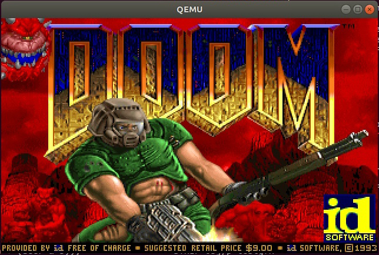

# PugOS DOOM Port

This is a port of id Software's 1997 DOOM Linux port to Harvard's Operating Systems class teaching OS, done by Lucas Cassels and Max Levenson as our final project. See our [PugOS repo](https://github.com/CS161/PugOS) for the modified teaching OS build which runs this DOOM port!

Major changes:
- Added support for targeting 64-bit architectures (required by PugOS)
- Rewrote input and rendering systems to work with PugOS
- Ported code from C to C++
- Replaced some Linux syscalls with equivalent PugOS syscalls
- Game saving/loading, sound, and networking are disabled due to OS limitations

## Dependencies

- GCC

## Running the game

Instructions for running the port in PugOS are in the [PugOS repo](https://github.com/CS161/PugOS) readme.

To run the 32-bit and 64-bit Linux builds, see the Linux branch section below.

## Linux branch

To aid in the porting process we've maintained a branch (named `x11`) that runs natively on Linux. This branch contains all x86-64 compatability changes, but no PugOS-specific changes. Additionally, since DOOM was written for X and screens from the 90s, this branch requires X11 and Xephyr to support a 320x200 pixel 8-bit color display. Note that rendered colors can be wrong in this branch.

To run the Linux build, switch to the `x11` branch and run `make run32` or `make run64` from within the linuxdoom-1.10 directory and the makefile will build the code, start up a 320x200x8 X screen, and run the game for you!
